开发套件是一个**自定义算法**开发工具，可满足用户训练自己专有模型，快速适配到算力设备，构建工业级智能分析产品。

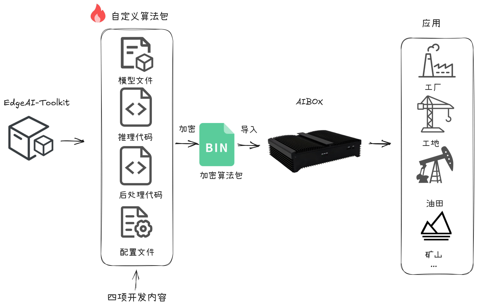

开发套件工作示意图。只需开发自定义算法包的四项内容，满足工厂、工地、油田、矿山等场景安全生产监测应用。

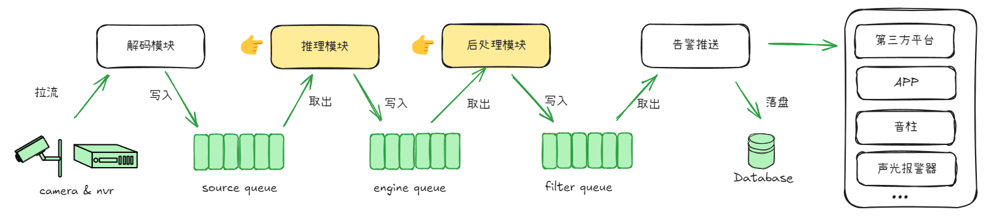

系统工作流程图。只需关注推理模块与后处理模块，按需开发算法模型与业务逻辑，可构建工业级智能分析应用。

## 新功能

- 2024年12月
  - 开放算法推理代码，用户可导入专有模型
  - 开放设备后台，用户可调试代码、查看日志
- 2024年11月
  - 开放算法后处理代码，用户可编写业务逻辑代码
  - 开放算法数据集，用户可训练优化标准模型

## 快速开始

参照如下步骤，快速开发一个**自定义算法包**。

| 第一步：确定任务类型                                         | 第二步：训练自有模型                                         | 第三步：编写推理或后处理代码                                 | 第四步：算法包配置&加密                                      |
| :----------------------------------------------------------- | :----------------------------------------------------------- | ------------------------------------------------------------ | ------------------------------------------------------------ |
| a. 根据业务需求，从[开发样例](#开发样例)中选择一种参考样例。 b. 在参考样例中，按照开发文档逐步操作。 | a. [模型训练](#03模型训练)：提供了5大类5种模型训练方法，若新训模型不在以上5种列表中，可自行开发训练。 b. [模型量化](#04模型量化)：提供瑞芯微量化工具，将onnx模型量化为rknn格式。 | a. 若新算法包所需模型在本仓库提供的[5种模型](#03模型训练)中，则无需编写推理代码，否则，参考[开发样例](#开发样例)编写推理代码。 b. 根据[开发样例](#开发样例)编写后处理代码。 | a. 参考[开发样例](#开发样例)，对算法包配置文件修改 b. 参考[开发样例](#开发样例)对算法包进行加密得到最终bin文件 |

## 01 算法包开发

### 开发样例

教程提供了八种算法包样例，用户可根据需求，参照相应样例，开发专有算法包。

|                             类型                             |                             介绍                             |                   参考样例                   | 视频教程                                                     |
| :----------------------------------------------------------: | :----------------------------------------------------------: | :------------------------------------------: | ------------------------------------------------------------ |
| 快速入门类 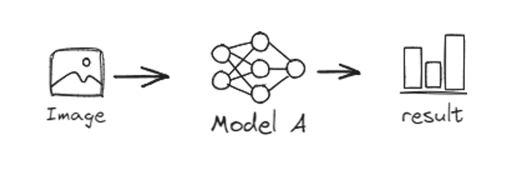 | 单模型目标检测算法。无需编写代码，替换为自有模型，修改配置即可使用。 |     [样例](engine/examples/quick_start)      | [查看](https://www.bilibili.com/video/BV17WQHYbEmY/?spm_id_from=333.1387.upload.video_card.click&vd_source=60ef6f0da0c658fa6bfed9073fea6ead) |
| 目标检测类  | 单模型目标检测算法。如区域入侵、离岗检测、车型检测等。业务逻辑简单，使用最广泛。 |   [样例](engine/examples/object_detection)   | [查看](https://www.bilibili.com/video/BV1BHQHYfEZy/?spm_id_from=333.1387.upload.video_card.click&vd_source=60ef6f0da0c658fa6bfed9073fea6ead) |
| 模型级联类 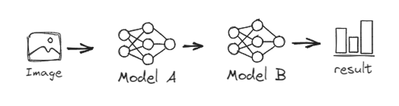 | 模型A的输出作为模型B的输入，算法基于模型B的输出决策。如未佩戴安全帽检测、抽烟检测、使用手机检测等。 |   [样例](engine/examples/model_cascading)    | [查看](https://www.bilibili.com/video/BV1zHQHYfEF2/?spm_id_from=333.1387.upload.video_card.click) |
| 模型并联类 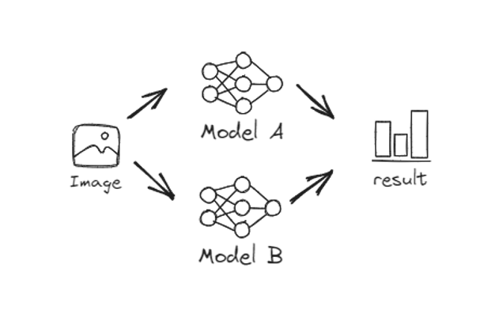  | 算法基于模型A/B的并行化输出决策。如未穿戴反光衣检测、挂钩高挂低用检测等。 |  [样例](engine/examples/model_parallelism)   | [查看](https://www.bilibili.com/video/BV1EHQHYfECQ/?spm_id_from=333.1387.upload.video_card.click) |
| 目标跟踪类 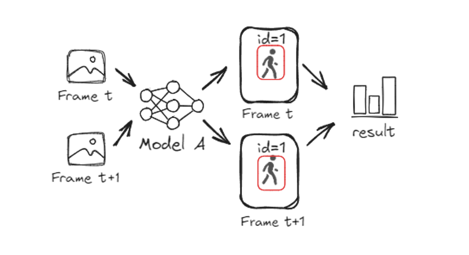 | 算法基于同一目标在多帧下的坐标或时间数据决策。如徘徊检测、睡岗检测等。 |   [样例](engine/examples/object_tracking)    | [查看](https://www.bilibili.com/video/BV1hzQHY7EMA/?spm_id_from=333.1387.upload.video_card.click) |
| 目标计数类 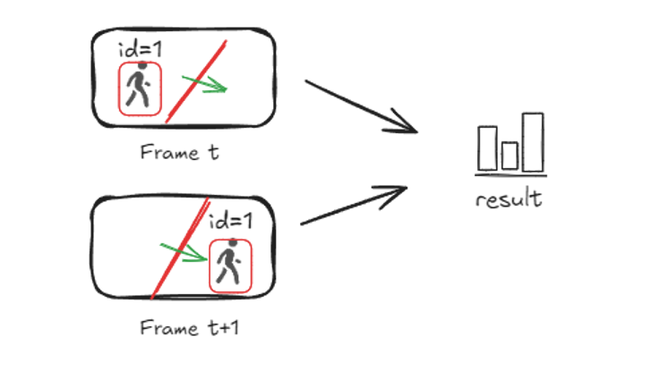 | 算法基于跟踪数据与预设直线数据决策。如人员计数、车辆计数等。 |   [样例](engine/examples/object_counting)    | [查看](https://www.bilibili.com/video/BV1gzQHY7Ea2/?spm_id_from=333.1387.upload.video_card.click) |
| 底库比对类 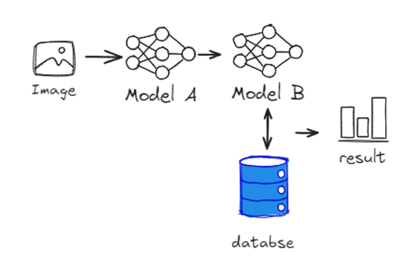 | 算法基于在线图像或目标特征与底库特征数据比对决策。如人脸识别、未穿工服检测、消防通道占用检测等。 | [样例](engine/examples/base_lib_comparision) | [查看](https://www.bilibili.com/video/BV1gzQHY7ES4/?spm_id_from=333.1387.upload.video_card.click) |
| 图像分类类  |       图像分类算法。如雨雾识别、矿石颗粒度等级检测等。       | [样例](engine/examples/image_classification) | [查看](https://www.bilibili.com/video/BV1pt5UzbEXE/?vd_source=60ef6f0da0c658fa6bfed9073fea6ead) |

## 02数据集

#### 标注工具

- 目标检测标注工具：[链接](https://pan.baidu.com/s/1PvFf5yUyW1jwhyiDWbFDEg?pwd=0000)
- 姿态&分割标注工具：[链接](https://pan.baidu.com/s/1PXnlpoZxmtK1cThaFEj1vg?pwd=0000)
- OCR标注工具：[链接](https://pan.baidu.com/s/1UudJGGLMBX0vWYn7JAYB0g?pwd=0000)

#### 标注样例

| [**目标检测**](https://pan.baidu.com/s/1luEjFr8_SHCRHhJFSkqjcA?pwd=0000) | [**实例分割**](https://pan.baidu.com/s/1fCIEHnce3V48h6ZZtKhq0A?pwd=0000) | [**姿态检测**](https://pan.baidu.com/s/1k5FKOWfKoInTKOEuuh8uLg?pwd=0000) |
| :----------------------------------------------------------: | :----------------------------------------------------------: | :----------------------------------------------------------: |
|            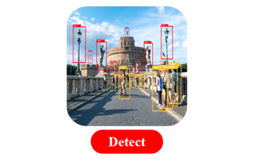             |                       |              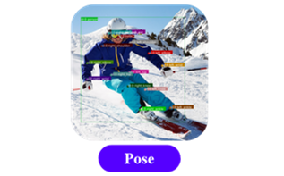               |
| [**图像分类**](https://pan.baidu.com/s/1heYpj7qgexHhIaQQ8_pDEA?pwd=0000) | [**字符识别**](https://pan.baidu.com/s/1Z9h46BJiRKqI_MKYUeoPLg?pwd=0000) | [**特征提取**](https://pan.baidu.com/s/1PHuvWME52MbeCgF3MvXTZQ?pwd=0000 ) |
|            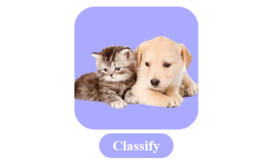             |               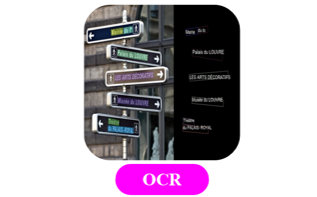                |             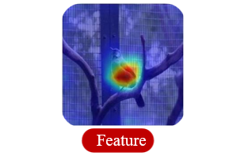              |

## 03模型训练

提供5大类5种模型训练方法。模型输入：数据集+预训练模型（可选），输出：onnx格式权重。提供数据集[标注工具](#标注工具)与[标注样例](#标注样例)，可参考标注数据集。

|                          目标检测 🚀                          |                          实例分割⭐                           |                           姿态检测                           |                           图像分类                           |                           字符识别                           |
| :----------------------------------------------------------: | :----------------------------------------------------------: | :----------------------------------------------------------: | :----------------------------------------------------------: | :----------------------------------------------------------: |
| 提供yolov5-6.2版本模型训练方法，快速训练专有检测模型。 [预训练权重](https://pan.baidu.com/s/1eGCl5q809TVYe8vh7heh3A?pwd=0000) [训练方法](train/detection/yolov5/README.md) | 提供yolov5-seg-7.0版本模型训练方法，快速训练专有分割模型。 [预训练权重](https://pan.baidu.com/s/11XLNJquvQB8zvBla9XhXpA?pwd=0000) [训练方法](train/segmentation/yolov5-seg/README.md) | 提供yolov8-pose-8.1版本模型训练方法，快速训练专有姿态模型。 [预训练权重](https://pan.baidu.com/s/1tsMtCUsilnOUZTt-kD--XA?pwd=0000) [训练方法](train/pose/yolov8-pose/README.md) | 提供resnet-18模型训练方法，快速训练专有分类模型。 [训练方法](train/classify/resnet18/README.md) | 提供paddleocr模型训练方法，快速训练字符识别专有模型。 [训练方法](train/ocr/paddleocr) |

## 04模型量化

提供瑞芯微量化套件，将onnx模型量化为rknn格式。

|       适配芯片       |                           量化套件                           |                           量化方法                           |
| :------------------: | :----------------------------------------------------------: | :----------------------------------------------------------: |
| 🔥瑞芯微RK3568/RK3588 | 提供python量化包 [下载](https://pan.baidu.com/s/1AVKxKGzBEc0iBMuSMJaDJQ?pwd=0000) | 提供模型量化方法，提高模型推理速度。 [文档](quantization/rockchip/README.md) |

## FAQ

提供自定义算法包开发与调试过程中的常见问题，如开发中存疑，可从[FAQ](./docs/FAQ.md)文档中查找答案。

## 授权

此版本中的代码和相关权重根据Apache 2.0许可证授权，可商用。

## 联系方式

- 官网：https://www.aidrive-tech.com
- 邮箱：support@aidrive-tech.com

