### 1. 下载示例算法包

```
git clone https://github.com/AIDrive-Research/EdgeAI-Toolkit.git
```

下载示例算法包，并在示例算法包上修改。

- 如果产品型号为ks968，则在ks968下的fog算法包上修改。
- 如果产品型号为ks916，则在ks916下的fog算法包上修改。


产品型号查看，产品型号在【系统设置】-【设备升级】中可查看。

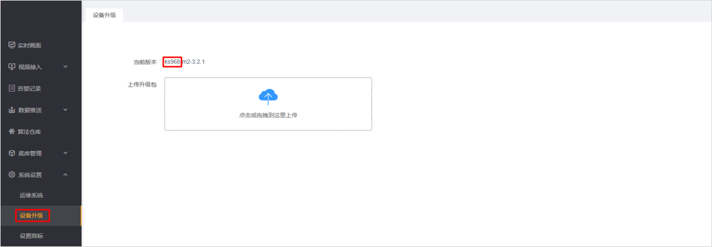

### 2. 模型训练

参考分类模型训练[文档](../../../train/classify/resnet18/)，训练模型。

注：经过模型训练，需导出onnx格式权重，便于后续模型量化。

### 3. 模型量化

模型量化参照[文档](../../../quantization/rockchip/)开发，量化完成后得到rknn模型。

### 4. 推理代码编写

下图推理模块调用流程图。


主程序循环调用`__init__.py`中的`infer`函数，该函数在每个实例中会被重写。

下图为推理模块流程图。

- **模型初始化：** 加载模型，加载模型配置文件。
- **模型推理：** 读取RGB图像，进行图像缩放、维度变换等预处理，并进行模型推理。
- **结果后处理：** 对推理结果进行softmax归一化。
- **结果写入：** 推理结果写入redis队列。

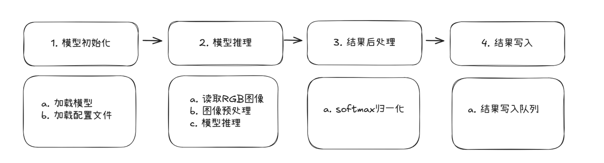

以**雨雾识别**算法为例进行说明。雨雾识别使用`ResNet-18`模型进行分类，推理代码`classify.py`如下。

```python
import numpy as np

from logger import LOGGER
from model import RknnModel


class Model(RknnModel):
    default_args = {
        'img_size': 224,
    }

    def __init__(self, acc_id, name, conf):
        super().__init__(acc_id, name, conf, ['model'])

    def _load_args(self, args):
        try:
            self.img_size = args.get('img_size', self.default_args['img_size'])
        except:
            LOGGER.exception('_load_args')
            return False
        return True

    @staticmethod
    def __softmax(x):
        # 计算指数
        exp_x = np.exp(x)
        # 对每行求和
        sum_exp_x = np.sum(exp_x, axis=1, keepdims=True)
        # 计算softmax
        softmax_output = exp_x / sum_exp_x
        return softmax_output

    def __infer_cls(self, image):
        image, _, _ = self._letterbox(image, (self.img_size, self.img_size), stretch=True)
        image = np.expand_dims(image, axis=0)
        outputs = self._rknn_infer('model', [image])
        return self.__softmax(outputs[0]).reshape(-1)

    def infer(self, data, **kwargs):
        """
        图像分类
        Args:
            data: 图像数据，ndarray类型，RGB格式（BGR格式需转换）
        Returns: infer_result
        """
        infer_result = None
        if self.status:
            try:
                image = data
                output = self.__infer_cls(image)
                obj = {
                    'output': output.tolist()
                }
                infer_result = obj
            except:
                LOGGER.exception('infer')
        return infer_result
```

**核心函数：infer**

###### 函数输入

- `data：`RGB图像数据
- `**kwargs：`用户自定义k-v参数对

###### 函数输出

- `infer_result`，格式如下。

```json
{
	"output": [0.6426429152488708, 0.2453276515007019, 0.11202946305274963]
}
```

###### 处理过程

- `self._letterbox():` 对输入图像进行填充缩放。
- `self._rknn_infer():` rknn模型推理。
- `self.__softmax():` 对推理结果进行归一化。

### 5. 后处理代码编写

下图为后处理模块调用流程图。

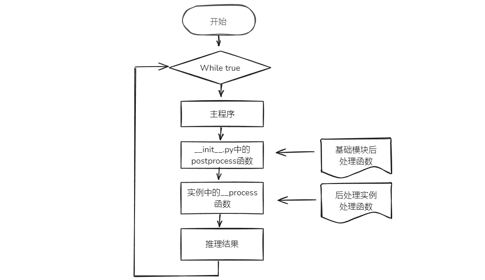

主程序循环调用`__init__.py`中的`postprocess`函数，该函数会调用每个后处理实例中的`__process`函数。

下图为后处理模块流程图。

- **初始化：** 后处理的输入参数与输出结果初始化。
- **后处理：** 过滤非标签目标，过滤低置信度目标，告警业务逻辑编写。
- **结果写入：** 结果写入告警队列。

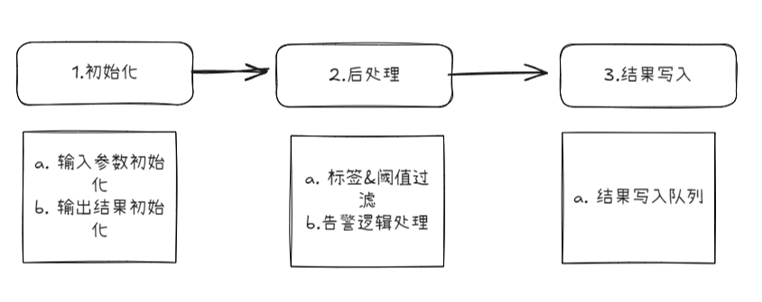

雨雾识别后处理代码`fog.py`如下。

```python
import numpy as np

from logger import LOGGER
from postprocessor import Postprocessor as BasePostprocessor
from .utils import json_utils
from .utils.cv_utils.color_utils import rgb_reverse
from .utils.cv_utils.crop_utils import crop_rectangle
from .utils.image_utils import base64_to_opencv, opencv_to_base64


class Postprocessor(BasePostprocessor):
    def __init__(self, source_id, alg_name):
        super().__init__(source_id, alg_name)
        self.cls_model_name = 'zql_fog_classify'
        self.timeout = None
        self.reinfer_result = {}
        self.fog_label = [0,2]

    @staticmethod
    def __get_polygons_box(polygons):
        points = []
        for id_, info in polygons.items():
            points.extend(info['polygon'])
        points = np.array(points)
        min_x = np.min(points[:, 0])
        min_y = np.min(points[:, 1])
        max_x = np.max(points[:, 0])
        max_y = np.max(points[:, 1])
        return [min_x, min_y, max_x, max_y]

    def __reinfer(self, polygons):
        count = 0
        draw_image = base64_to_opencv(self.draw_image)
        if polygons:
            roi = self.__get_polygons_box(polygons)
            cropped_image = crop_rectangle(draw_image, roi)
        else:
            cropped_image = draw_image
        if cropped_image is not None:
            cropped_image = rgb_reverse(cropped_image)
            source_data = {
                'source_id': self.source_id,
                'time': self.time * 1000000,
                'infer_image': opencv_to_base64(cropped_image),
                'draw_image': None,
                'reserved_data': {
                    'specified_model': [self.cls_model_name],
                    'unsort': True
                }
            }
            self.rq_source.put(json_utils.dumps(source_data))
            count += 1
        if count > 0:
            self.reinfer_result[self.time] = {
                'count': count,
                'draw_image': self.draw_image,
                'result': []
            }
        return count

    def __check_expire(self):
        for time in list(self.reinfer_result.keys()):
            if time < self.time - self.timeout:
                LOGGER.warning('Reinfer result expired, source_id={}, alg_name={}, time={}, timeout={}'.format(
                    self.source_id, self.alg_name, time, self.timeout))
                del self.reinfer_result[time]
        return True

    def _process(self, result, filter_result):
        hit = False
        if self.timeout is None:
            self.timeout = (self.frame_interval / 1000) * 2
            LOGGER.info('source_id={}, alg_name={}, timeout={}'.format(self.source_id, self.alg_name, self.timeout))
        polygons = self._gen_polygons()
        if not self.reserved_data:
            count = self.__reinfer(polygons)
            if not count:
                self.__check_expire()
                result['hit'] = False
                result['data']['bbox']['polygons'].update(polygons)
                return True
            return False
        self.__check_expire()
        model_name, rectangles = next(iter(filter_result.items()))
        if model_name != self.cls_model_name:
            LOGGER.error('Get wrong model result, expect {}, but get {}'.format(self.cls_model_name, model_name))
            return False
        if self.reinfer_result.get(self.time) is None:
            LOGGER.warning('Not found reinfer result, time={}'.format(self.time))
            return False
        self.reinfer_result[self.time]['result'].append(rectangles)
        if len(self.reinfer_result[self.time]['result']) < self.reinfer_result[self.time]['count']:
            return False
        reinfer_result_ = self.reinfer_result.pop(self.time)
        self.draw_image = reinfer_result_['draw_image']
        for targets in reinfer_result_['result']:
            if not targets:
                continue
            hit = True
        result['hit'] = hit
        result['data']['bbox']['polygons'].update(polygons)
        return result

    def _filter(self, model_name, model_data):
        targets = []
        model_conf = model_data['model_conf']
        engine_result = model_data['engine_result']
        if engine_result:
            score = np.max(engine_result['output'])
            label = np.argmax(engine_result['output'])
            if score >= model_conf['args']['conf_thres'] and label in self.fog_label:
                targets.append(engine_result)
        return targets
```

**核心函数：__process**

###### 函数输入

- `result：`结果字典。包括是否命中`hit`，以及告警结果数据`data`。若后处理产生告警，则`hit`为`true`，否则为`false`。`data`中，`rectangles`为目标框数据，`polygons`为多边形检测区域数据，`lines`为虚拟直线数据，在人员计数等算法中使用。`custom`为用户自定义的数据。

```json
{
	"hit": true,
	"data": {
		"bbox": {
			"rectangles": [],
			"polygons": {},
			"lines": {}
		},
		"custom": {}
	}
}
```

- `filter_result`：标签过滤以及低置信度过滤后的结果。`zql_fog_classify`指的是模型名称，后面的值是模型的推理结果list。

```json
{
	"zql_fog_classify": [{
		"output": [0.6289392709732056, 0.26854440569877625, 0.1025162935256958]
	}]
}
```

###### 函数输出

`True` or `False`

### 6. 配置文件修改

至此，已得到模型文件，推理代码，后处理代码。下面对算法名称、模型名称、模型文件、模型类型、yaml配置文件、json文件修改。

| 修改项             | 详情                                                         |
| ------------------ | ------------------------------------------------------------ |
| 算法名称           | 算法包文件夹名称、后处理代码文件名称、后处理json文件名称以及postprocessor.yaml中的name需要保持一致。新算法名称不得与已有算法名称重复。 |
| 模型名称           | 模型文件夹名称、model.yaml中的模型名称、postprocessor.yaml中的模型名称、xxx.json中的模型名称需保持一致。新模型名称不得与已有模型名称重复。 |
| 模型文件           | 模型文件夹下的模型，统一命名model（不要命名为model.rknn）    |
| 模型类型           | model文件夹下的.py文件为模型类型，新模型类型不得与已有模型类型重复。 |
| model.yaml         | 修改模型名称、检测类型（模型名称）、输入参数、推理时间。     |
| postprocessor.yaml | 修改算法中英文名称、算法描述、分组类别、模型配置。           |
| xxx.json           | 修改json文件中的模型名称、算法名称、语音文本等内容。         |

- **算法名称修改**。修改为自己定义的算法名称，如：custom_person_intrusion，若不修改，会覆盖已有算法文件。

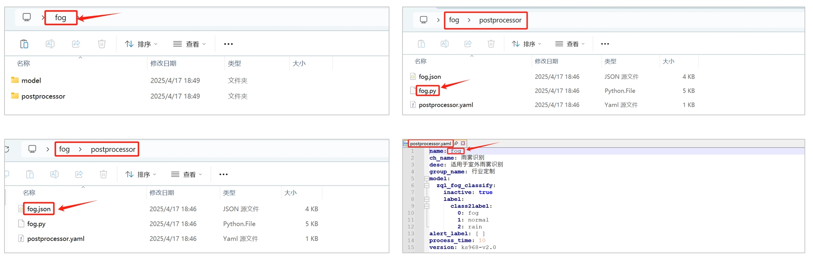

- **模型名称修改**。修改为自定义的模型名称，如custom_person，若不修改，会覆盖已有模型。

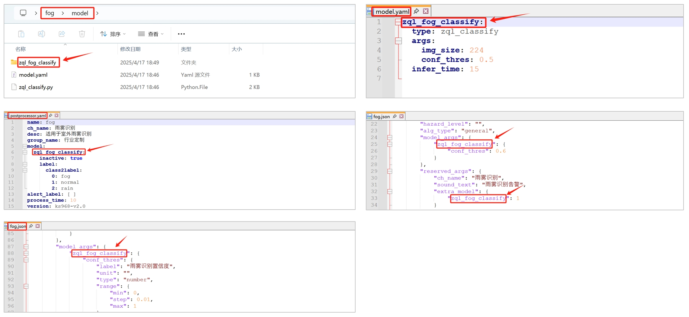

- **模型文件修改**。量化后的模型文件统一命名为model，如下图所示，不可命名为model.rknn。


- **模型类型修改**。模型类型为推理代码文件名称，修改为自定义名称。如custom_classify.py。

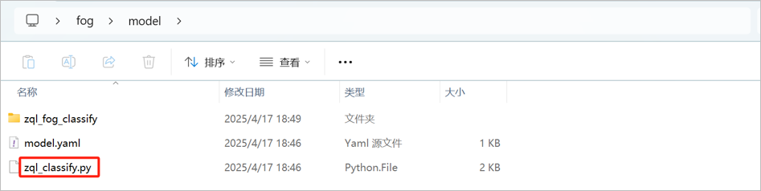

- **model.yaml文件修改**。第一行是模型名称，第二行模型类型是推理代码的名称，第4行-第6行是模型输入参数。第7行是模型推理时间，其设置应当保证source队列没有积压，队列存在积压，则增加推理时间。

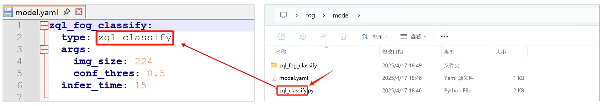

- **postprocessor.yaml文件修改**。第一行是算法名称，第二行是算法中文名称，第三行是算法描述，第四行是算法组类别，第6行至第13行是模型参数，第14行是告警label。

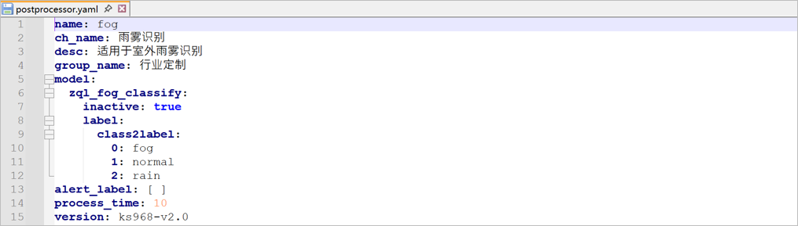

- 前端配置文件xxx.json修改。详细可参照[前端配置文件](../../JSON.md)。修改模型名称、算法名称、语音播报内容、置信度label等。

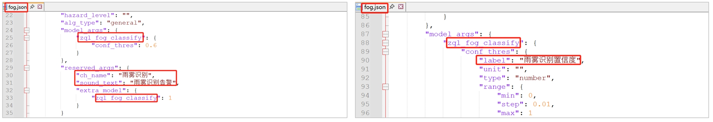

### 7. 算法包加密&导入

- 将算法包加密为bin文件。下载算法包[加密工具](https://pan.baidu.com/s/173r6sLMh77n3JrKkLnSpYg?pwd=0000)。将待加密算法包放在文件夹内（文件夹只含单个算法包），填写待加密算法包的上级路径（如下述文件夹所示），点击【确定】按钮，提示即将加密的算法包名称，点击【ok】；

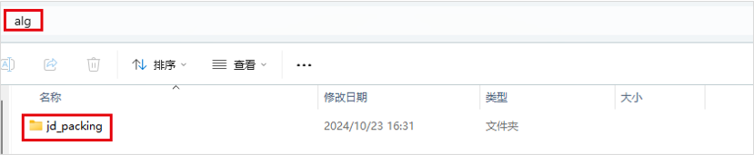

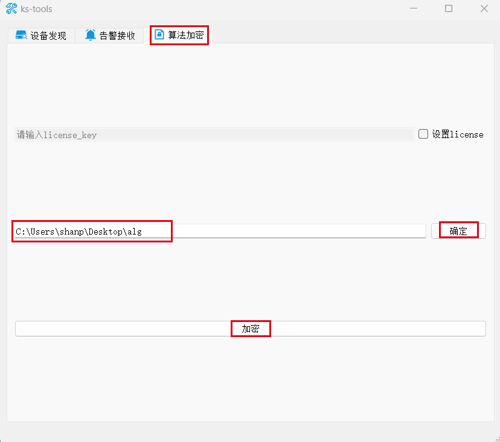

- 加密完成的bin文件为最终文件，从盒子后台管理系统【算法仓库】中导入即可。


### 8. 代码调试

- 在下图所示红色框内，连续点击7次，打开开发者模式（版本≥3.1.6具备此功能）

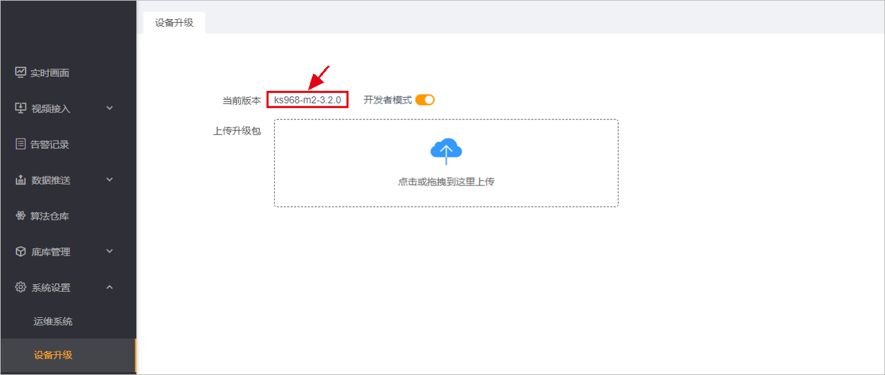

- 在高级设置，终端管理中，可进入盒子后台调试&查看日志（请勿删除系统源码，谨慎操作，否则造成设备不可用）

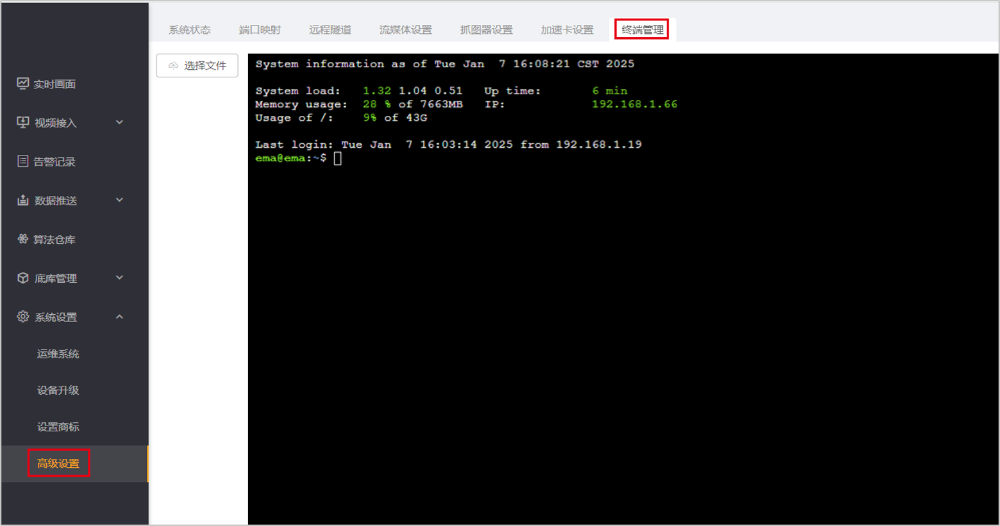

- 调试代码。导入`logger`包，使用`LOGGER.info`输出日志。示例如下。

```python
from logger import LOGGER

LOGGER.info('boxes:{},classes:{},scores:{}'.format(boxes, classes, scores))
```

-  查看日志

查看推理模块日志

```bash
tail -f ks/ks968/data/logs/engine/0/engine.log
```

查看后处理模块日志

```bash
tail -f ks/ks968/data/logs/filter/filter.log
```

### 9. 附录

以上的推理与后处理实例继承分别继承于model与postprocessor基类，对于基类的具体解释如下。

推理与后处理代码位于[general](../../general)文件夹下。下图为模块调用流程图。

- **推理模块**：从解码队列中取出图像数据，进行模型推理，并将推理结果写入推理队列。
- **后处理模块**：从推理队列中取出结构化数据进行业务逻辑处理产生告警，并将告警结果写入告警队列。

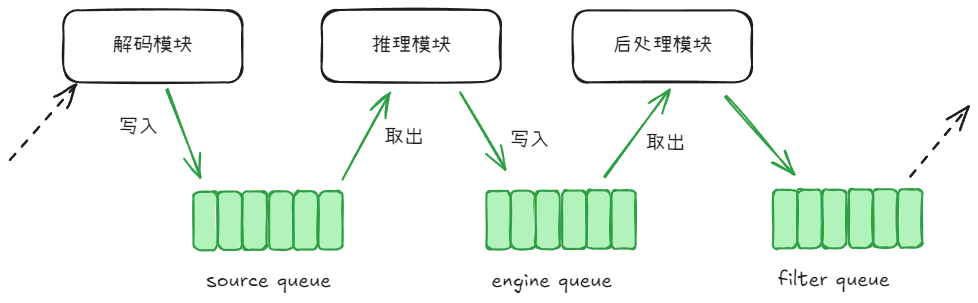

#### 推理模块代码说明

推理模块代码包括`基础模块`与`推理实例`两部分。

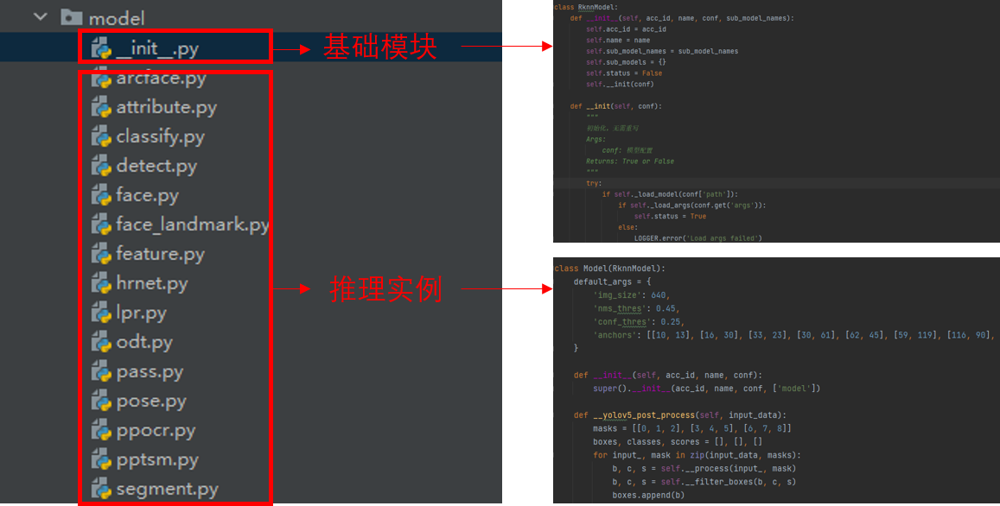

**A. 基础模块**`__init__.py`

`模型推理base模块`中的`RknnModel`类的成员函数按功能可以分为以下3类：`初始化函数`、`核心逻辑函数`、`工具函数`。其中`工具函数`无需在后处理实例模块中覆写（`override`）；`初始化函数`中的部分函数无需覆写，部分函数如（`_load_args`）根据自定义需求覆写；`核心逻辑函数`通常需要覆写。

**初始化函数**

|   函数名称    |             函数功能              |
| :-----------: | :-------------------------------: |
|  _load_model  |   加载模型，**通常不需要覆写**    |
|  _load_args   |  加载模型参数，**通常需要覆写**   |
| _init_runtime | 初始化runtime环境，**不需要覆写** |
|  _rknn_infer  |   rknn模型推理，**不需要覆写**    |
|    release    | 释放已加载的模型，**不需要覆写**  |

**核心逻辑函数**

| 函数名称 |        函数功能        |
| :------: | :--------------------: |
|  infer   | 推理函数，**需要覆写** |

**B. 推理实例**

###### 基础算法类型

* `zql_arcface`：特征提取算法，适用于工服检测、未佩戴护目镜检测、未戴手套检测等；
* `zql_classify`：分类算法，适用于睡岗识别、安全帽识别、火焰识别等；
* `zql_detect`：目标检测算法，适用于基于yolov5的检测模型；
* `zql_face_landmark`：人脸关键点提取，适用于疲劳检测；
* `zql_face`：人脸检测+人脸特征提取，适用于人脸识别；
* `zql_feature`：特征提取算法，适用于消防通道占用等；
* `zql_hrnet`：人体关键点检测模型，适用于hrnet的关键点检测模型；
* `zql_lpr`：车牌检测+车牌识别，适用于车牌识别；
* `zql_pass`：适用于无模型的算法；
* `zql_pose`：人体关键点检测，适用于基于yolov8.1的关键点检测模型；
* `zql_ppocr`：光学字符检测+识别，适用于光学字符识别；
* `zql_segment`：分割算法，适用于基于yolov5-v7.0的分割模型；

【注：自定义推理模型，避免与基础算法类型相同】

###### 函数参数

* `data`，推理数据，通常是图像数据。

* `**kwargs`，用户自定义`k-v`参数对。

#### 后处理模块代码说明

**A. 基础模块`__init__.py`**

算法后处理模块在`filter`算子中实现，代码路径：`filter/postprocessor`，其内部按功能可划分为：`工具模块`、`后处理模块`，其中`后处理模块`又可细分为：`后处理base模块`以及`后处理实例模块`，目录结构如下图所示。

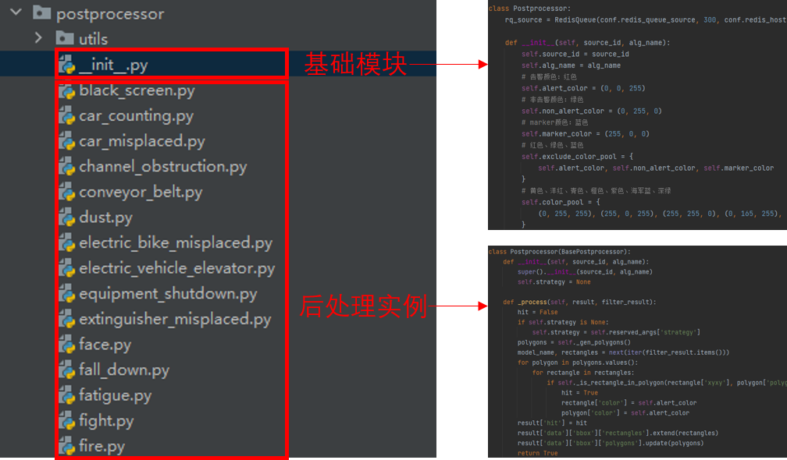

**入口函数**

|  函数名称   |       函数功能       |
| :---------: | :------------------: |
| postprocess | 后处理模块的入口函数 |

**核心逻辑函数**

| 函数名称 |                   函数功能                   |
| :------: | :------------------------------------------: |
| _filter  |       过滤掉不符合条件的目标，按需覆写       |
| _process | 处理过滤之后的结果，并生成最终结果，按需覆写 |

##### _filter

###### 函数参数

* `model_name`，模型名称，注意：`模型名称`有别于`算法名称`以及`模型类型`。

* `model_data`，模型数据，由算法引擎推理结果以及相关参数组成的结构化数据。

  ```json
  {
      "engine_result": [{
              "conf": 0.45,
              "label": 0,
              "xyxy": [375, 105, 424, 142]
          }, {
              "conf": 0.29,
              "label": 0,
              "xyxy": [320, 120, 368, 137]
          }
      ],
      "model_conf": {
          "args": {
              "conf_thres": 0.5
          },
          "label": {
              "class2label": {
                  "0": "fire"
              },
              "label2color": {
                  "火焰": [0, 0, 255]
              },
              "label_map": {
                  "fire": "火焰"
              }
          }
      }
  }
  ```

  其中，`engine_result`为算法引擎推理结果，`model_conf`为算法参数。

###### 函数输出

函数输出为过滤之后的结果：

```json
[
    {
        "conf": 0.63,
        "label": 0,
        "xyxy": [313, 95, 428, 142]
    }
]
```

##### _process

###### 函数参数

* `result`，后处理最终的输出数据结构模板。

  ```json
  {
      "data": {
          "bbox": {
              "lines": {},
              "polygons": {},
              "rectangles": []
          },
          "custom": {}
      },
      "hit": false
  }
  ```

  其中，`data/bbox`是用与在告警结果中画框的相关数据，`data/custom`是用户的自定义数据，`hit`表示是否命中了告警行为。

* `filter_result`，过滤器过滤之后的相关模型（如：`fire`、`fire_classify`）的结果数据

  ```json
  {
      "fire": [{
              "color": [0, 0, 255],
              "conf": 0.63,
              "ext": {},
              "label": "火焰",
              "xyxy": [626, 190, 856, 284]
          }
      ],
      "fire_classify": []
  }
  ```

###### 函数输出

`True` or `False`

**工具函数**

|             函数名称              |                           函数功能                           |
| :-------------------------------: | :----------------------------------------------------------: |
|            _is_in_plan            | 判定算法是否在布控计划时间内，不在布控计划时间内的算法不予处理 |
|            _get_label             |                       获取目标的label                        |
|         _gen_random_color         |                        生成随机color                         |
|            _get_color             |                       获取目标的color                        |
|            _get_point             | 根据指定策略获取矩形框的点，如：中心点、下边沿中心点、右边沿中心点 |
|     _is_rectangle_in_polygon      |                   判断矩形框是否在多边形内                   |
|       _cross_line_counting        |                           跨线计数                           |
| _merge_cross_line_counting_result |                       合并跨线计数结果                       |
|             _set_ext              |                       设置扩展字段的值                       |
|             _get_ext              |                       获取扩展字段的值                       |
|          _gen_rectangle           |                          生成矩形框                          |
|           _gen_polygons           |                          生成多边形                          |
|            _gen_lines             |                           生成线段                           |
|              _scale               |                           坐标缩放                           |
|          _filter_by_conf          |                  过滤掉置信度低于阈值的目标                  |
|         _filter_by_label          |                 过滤掉不在label列表中的目标                  |
|          _filter_by_roi           |                过滤掉中心点不在多边形内的目标                |

**B. 后处理实例**

每个算法使用自有后处理代码，详见每个类型实例部分代码说明。
