### 1. 下载示例算法包

```
git clone https://github.com/AIDrive-Research/EdgeAI-Toolkit.git
```

下载示例算法包，并在示例算法包上修改。

- 如果产品型号为ks968，则在ks968下的person_intrusion算法包上修改。
- 如果产品型号为ks916，则在ks916下的person_intruson算法包上修改。

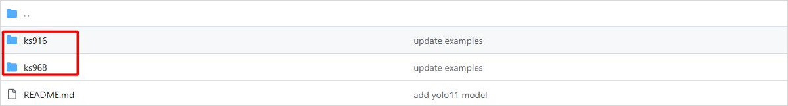

产品型号查看，产品型号在【系统设置】-【设备升级】中可查看。

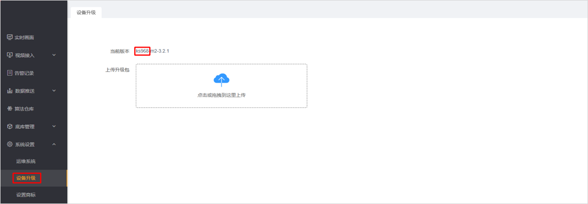

### 2. 模型训练

- 标准模型训练：[本仓库](../../../)03模型训练中，提供了5大类5种模型训练方法。
- 自有模型训练：根据自有代码训练模型。

注：经过模型训练，需导出onnx格式权重，便于后续模型量化。

### 3. 模型量化

模型量化参照[文档](../../../quantization/rockchip/)开发，量化完成后得到rknn模型。

### 4. 推理代码编写

下图推理模块调用流程图。

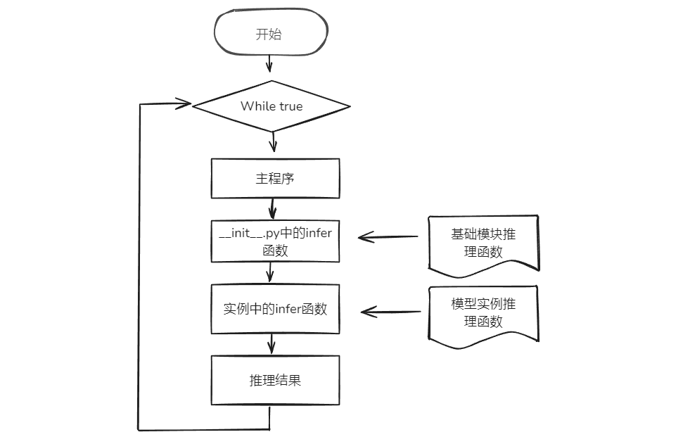

主程序循环调用`__init__.py`中的`infer`函数，该函数在每个实例中会被重写。

下图为推理模块流程图。

- **模型初始化：** 加载模型，加载模型配置文件。
- **模型推理：** 读取RGB图像，进行图像缩放、维度变换等预处理，并进行模型推理。
- **结果后处理：** 执行阈值过滤与nms过滤等操作，对低阈值目标，重复目标进行过滤。
- **结果写入：** 推理结果写入redis队列。

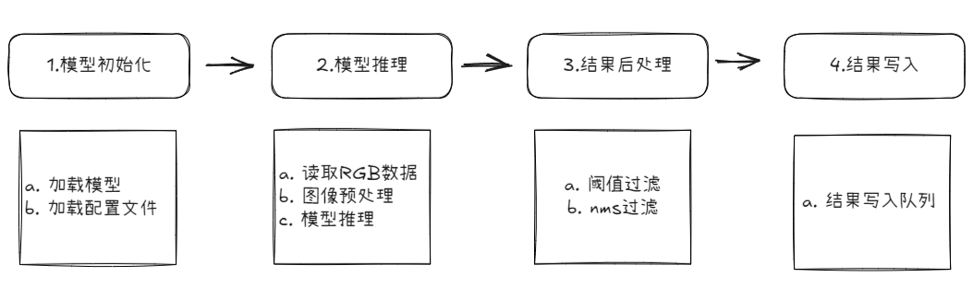

以**区域入侵算法**为例进行说明。区域入侵使用`yolov5`模型检测人体目标，推理代码`detect.py`如下。

```python
import cv2
import numpy as np

from logger import LOGGER
from model import RknnModel


class Model(RknnModel):
    default_args = {
        'img_size': 640,
        'nms_thres': 0.45,
        'conf_thres': 0.25,
        'anchors': [[10, 13], [16, 30], [33, 23], [30, 61], [62, 45], [59, 119], [116, 90], [156, 198], [373, 326]]
    }

    def __init__(self, acc_id, name, conf):
        super().__init__(acc_id, name, conf, ['model'])

    def __yolov5_post_process(self, input_data):
        masks = [[0, 1, 2], [3, 4, 5], [6, 7, 8]]
        boxes, classes, scores = [], [], []
        for input_, mask in zip(input_data, masks):
            b, c, s = self.__process(input_, mask)
            b, c, s = self.__filter_boxes(b, c, s)
            boxes.append(b)
            classes.append(c)
            scores.append(s)
        boxes = np.concatenate(boxes)
        boxes = self._xywh2xyxy(boxes)
        classes = np.concatenate(classes)
        scores = np.concatenate(scores)
        nboxes, nclasses, nscores = [], [], []
        keep = self._nms_boxes(boxes, scores)
        if len(keep) != 0:
            nboxes.append(boxes[keep])
            nclasses.append(classes[keep])
            nscores.append(scores[keep])
        if not nclasses and not nscores:
            return None, None, None
        return np.concatenate(nboxes), np.concatenate(nclasses), np.concatenate(nscores)

    def __process(self, input_, mask):
        anchors = [self.anchors[i] for i in mask]
        grid_h, grid_w = map(int, input_.shape[0:2])
        box_confidence = input_[..., 4]
        box_confidence = np.expand_dims(box_confidence, axis=-1)
        box_class_probs = input_[..., 5:]
        box_xy = input_[..., :2] * 2 - 0.5
        col = np.tile(np.arange(0, grid_w), grid_w).reshape(-1, grid_w)
        row = np.tile(np.arange(0, grid_h).reshape(-1, 1), grid_h)
        col = col.reshape(grid_h, grid_w, 1, 1).repeat(3, axis=-2)
        row = row.reshape(grid_h, grid_w, 1, 1).repeat(3, axis=-2)
        grid = np.concatenate((col, row), axis=-1)
        box_xy += grid
        box_xy *= int(self.img_size / grid_h)
        box_wh = pow(input_[..., 2:4] * 2, 2)
        box_wh = box_wh * anchors
        return np.concatenate((box_xy, box_wh), axis=-1), box_confidence, box_class_probs

    def __filter_boxes(self, boxes, box_confidences, box_class_probs):
        """
        Filter boxes with box threshold. It's a bit different with origin yolov5 post process!
        Args:
            boxes: ndarray, boxes of objects.
            box_confidences: ndarray, confidences of objects.
            box_class_probs: ndarray, class_probs of objects.
        Returns:
            boxes: ndarray, filtered boxes.
            classes: ndarray, classes for boxes.
            scores: ndarray, scores for boxes.
        """
        boxes = boxes.reshape(-1, 4)
        box_confidences = box_confidences.reshape(-1)
        box_class_probs = box_class_probs.reshape(-1, box_class_probs.shape[-1])
        _box_pos = np.where(box_confidences >= self.conf_thres)
        boxes = boxes[_box_pos]
        box_confidences = box_confidences[_box_pos]
        box_class_probs = box_class_probs[_box_pos]
        class_max_score = np.max(box_class_probs, axis=-1)
        classes = np.argmax(box_class_probs, axis=-1)
        _class_pos = np.where(class_max_score >= self.conf_thres)
        return boxes[_class_pos], classes[_class_pos], (class_max_score * box_confidences)[_class_pos]

    def _load_args(self, args):
        try:
            self.img_size = args.get('img_size', self.default_args['img_size'])
            self.nms_thres = args.get('nms_thres', self.default_args['nms_thres'])
            self.conf_thres = args.get('conf_thres', self.default_args['conf_thres'])
            self.anchors = args.get('anchors', self.default_args['anchors'])
        except:
            LOGGER.exception('_load_args')
            return False
        return True

    def infer(self, data, **kwargs):
        """
        目标检测
        Args:
            data: 图像数据，ndarray类型，RGB格式（BGR格式需转换）
        Returns: infer_result
        """
        infer_result = []
        if self.status:
            try:
                image = data
                scale = 1
                raw_width, raw_height = image.shape[1], image.shape[0]
                if max(image.shape[:2]) != self.img_size:
                    scale = self.img_size / max(image.shape[:2])
                    if raw_height > raw_width:
                        image = cv2.resize(image, (int(raw_width * scale), self.img_size))
                    else:
                        image = cv2.resize(image, (self.img_size, int(raw_height * scale)))
                image, dw, dh = self._letterbox(image, (self.img_size, self.img_size))
                image = np.expand_dims(image, axis=0)
                outputs = self._rknn_infer('model', [image])
                input0_data = outputs[0].reshape([3, -1] + list(outputs[0].shape[-2:]))
                input1_data = outputs[1].reshape([3, -1] + list(outputs[1].shape[-2:]))
                input2_data = outputs[2].reshape([3, -1] + list(outputs[2].shape[-2:]))
                input_data = list()
                input_data.append(np.transpose(input0_data, (2, 3, 0, 1)))
                input_data.append(np.transpose(input1_data, (2, 3, 0, 1)))
                input_data.append(np.transpose(input2_data, (2, 3, 0, 1)))
                boxes, classes, scores = self.__yolov5_post_process(input_data)
                if boxes is not None:
                    for i, box in enumerate(boxes):
                        obj = {
                            'label': int(classes[i]),
                            'conf': round(float(scores[i]), 2)
                        }
                        xyxy = [int(box[0] - dw), int(box[1] - dh), int(box[2] - dw), int(box[3] - dh)]
                        if scale != 1:
                            xyxy = [int(x / scale) for x in xyxy]
                        obj['xyxy'] = [xyxy[0] if xyxy[0] >= 0 else 0,
                                       xyxy[1] if xyxy[1] >= 0 else 0,
                                       xyxy[2] if xyxy[2] <= raw_width else raw_width,
                                       xyxy[3] if xyxy[3] <= raw_height else raw_height]
                        infer_result.append(obj)
            except:
                LOGGER.exception('infer')
        return infer_result
```

**核心函数：infer**

###### 函数输入

- `data：`RGB图像数据
- `**kwargs：`用户自定义k-v参数对

###### 函数输出

- `infer_result`，格式如下。

```json
[
    {
        "conf": 0.38,
        "label": 0,
        "xyxy": [314, 93, 435, 142]
    }, {
        "conf": 0.36,
        "label": 0,
        "xyxy": [538, 258, 553, 269]
    }
]
```

###### 处理过程

- `self._letterbox():` 对输入图像进行填充缩放。
- `self._rknn_infer():` rknn模型推理。
- `self.__yolov5_post_process():` 对rknn推理结果进行目标框、类别、置信度解码；过滤低置信度目标；非极大值抑制去除冗余目标。

### 5. 后处理代码编写

下图为后处理模块调用流程图。

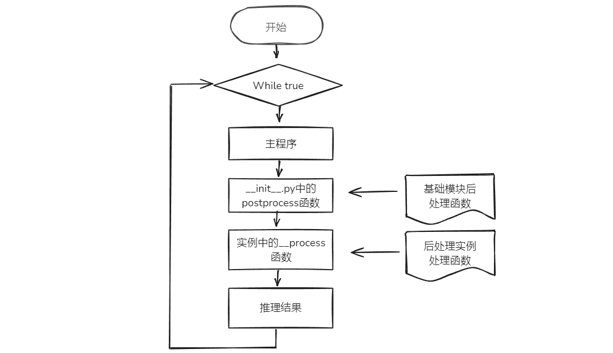

主程序循环调用`__init__.py`中的`postprocess`函数，该函数会调用每个后处理实例中的`__process`函数。

下图为后处理模块流程图。

- **初始化：** 后处理的输入参数与输出结果初始化。
- **后处理：** 过滤非标签目标，过滤低置信度目标，告警业务逻辑编写。
- **结果写入：** 结果写入告警队列。

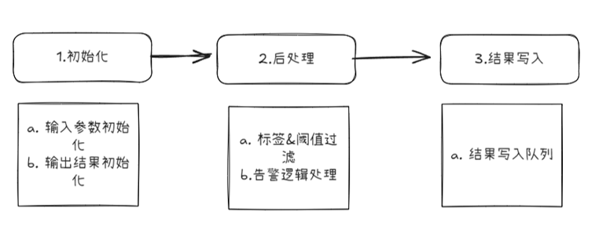

区域入侵后处理代码`person_intrusion.py`如下。

```python
from postprocessor import Postprocessor as BasePostprocessor


class Postprocessor(BasePostprocessor):
    def __init__(self, source_id, alg_name):
        super().__init__(source_id, alg_name)
        self.strategy = None

    def _process(self, result, filter_result):
        hit = False
        if self.strategy is None:
            self.strategy = self.reserved_args['strategy']
        polygons = self._gen_polygons()
        model_name, rectangles = next(iter(filter_result.items()))
        for polygon in polygons.values():
            for rectangle in rectangles:
                if self._is_rectangle_in_polygon(rectangle['xyxy'], polygon['polygon'], self.strategy):
                    hit = True
                    rectangle['color'] = self.alert_color
                    polygon['color'] = self.alert_color
        result['hit'] = hit
        result['data']['bbox']['rectangles'].extend(rectangles)
        result['data']['bbox']['polygons'].update(polygons)
        return True

    def _filter(self, model_name, model_data):
        targets = []
        model_conf = model_data['model_conf']
        engine_result = model_data['engine_result']
        for engine_result_ in engine_result:
            # 过滤掉置信度低于阈值的目标
            if not self._filter_by_conf(model_conf, engine_result_['conf']):
                continue
            # 过滤掉不在label列表中的目标
            label = self._filter_by_label(model_conf, engine_result_['label'])
            if not label:
                continue
            # 坐标缩放
            xyxy = self._scale(engine_result_['xyxy'])
            # 生成矩形框
            targets.append(self._gen_rectangle(xyxy, self.non_alert_color, label, engine_result_['conf']))
        return targets

```

**核心函数：__process**

###### 函数输入

- `result：`结果字典。包括是否命中`hit`，以及告警结果数据`data`。若后处理产生告警，则`hit`为`true`，否则为`false`。`data`中，`rectangles`为目标框数据，`polygons`为多边形检测区域数据，`lines`为虚拟直线数据，在人员计数等算法中使用。`custom`为用户自定义的数据。

```json
{
	"hit": true,
	"data": {
		"bbox": {
			"rectangles": [{
				"xyxy": [130, 150, 358, 538],
				"color": [0, 0, 255],
				"label": "人",
				"conf": 0.9,
				"ext": {}
			}]
		},
		"polygons": {
			"polygon_7c47c3d3-18ff-4b67-90ea-15428c136ec3": {
				"name": "",
				"polygon": [
					[3, 698],
					[8, 0],
					[1275, 6],
					[1270, 698]
				],
				"color": [0, 0, 255],
				"ext": {}
			}
		}
	}
}
```

- `filter_result`：标签过滤以及低置信度过滤后的结果。`person`指的是模型名称，后面的值是模型的推理结果list。

```json
{
	"person": [{
		"xyxy": [130, 150, 358, 538],
		"color": [0, 0, 255],
		"label": "人",
		"conf": 0.9,
		"ext": {}
	}]
}
```

###### 函数输出

`True` or `False`

### 6. 配置文件修改

至此，已得到模型文件，推理代码，后处理代码。下面对算法名称、模型名称、模型文件、模型类型、yaml配置文件、json文件修改。

| 修改项             | 详情                                                         |
| ------------------ | ------------------------------------------------------------ |
| 算法名称           | 算法包文件夹名称、后处理代码文件名称、后处理json文件名称以及postprocessor.yaml中的name需要保持一致。新算法名称不得与已有算法名称重复。 |
| 模型名称           | 模型文件夹名称、model.yaml中的模型名称、postprocessor.yaml中的模型名称、xxx.json中的模型名称需保持一致。新模型名称不得与已有模型名称重复。 |
| 模型文件           | 模型文件夹下的模型，统一命名model（不要命名为model.rknn）    |
| 模型类型           | model文件夹下的.py文件为模型类型，新模型类型不得与已有模型类型重复。 |
| model.yaml         | 修改模型名称、检测类型（模型名称）、输入参数、推理时间。     |
| postprocessor.yaml | 修改算法中英文名称、算法描述、分组类别、模型配置。           |
| xxx.json           | 修改json文件中的模型名称、算法名称、语音文本等内容。         |

- **算法名称修改**。修改为自己定义的算法名称，如：custom_person_intrusion，若不修改，会覆盖已有算法文件。

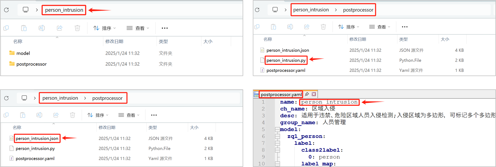

- **模型名称修改**。修改为自定义的模型名称，如custom_person，若不修改，会覆盖已有模型。

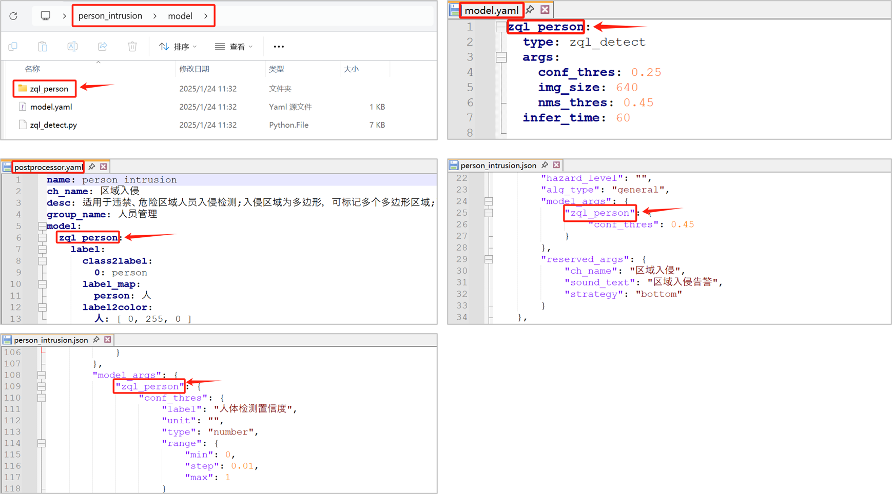

- **模型文件修改**。量化后的模型文件统一命名为model，如下图所示，不可命名为model.rknn。

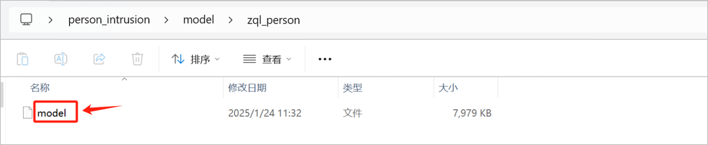

- **模型类型修改**。模型类型为推理代码文件名称，修改为自定义名称。如custom_detect.py。

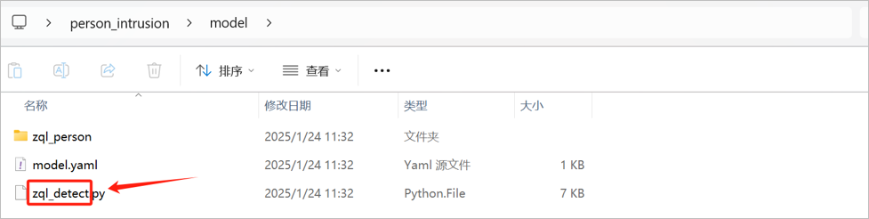

- **model.yaml文件修改**。第一行是模型名称，第二行模型类型是推理代码的名称，第4行-第6行是模型输入参数。第7行是模型推理时间，其设置应当保证source队列没有积压，队列存在积压，则增加推理时间。

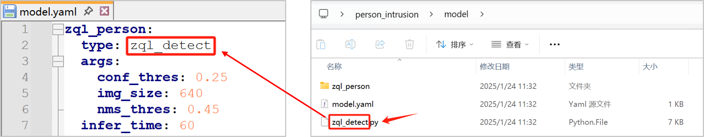

- **postprocessor.yaml文件修改**。第一行是算法名称，第二行是算法中文名称，第三行是算法描述，第四行是算法组类别，第6行至第13行是模型参数，第14行是告警label。

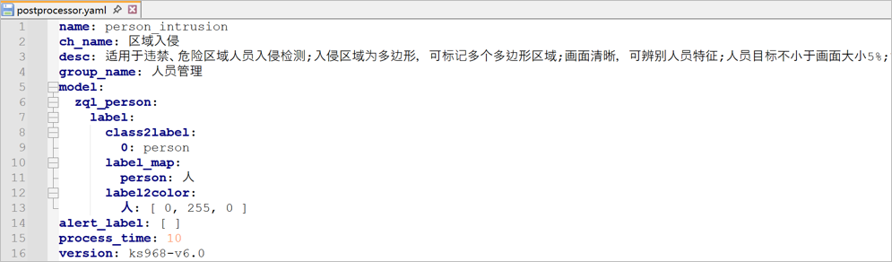

- 前端配置文件xxx.json修改。详细可参照[前端配置文件](../../JSON.md)。修改模型名称、算法名称、语音播报内容、置信度label等。

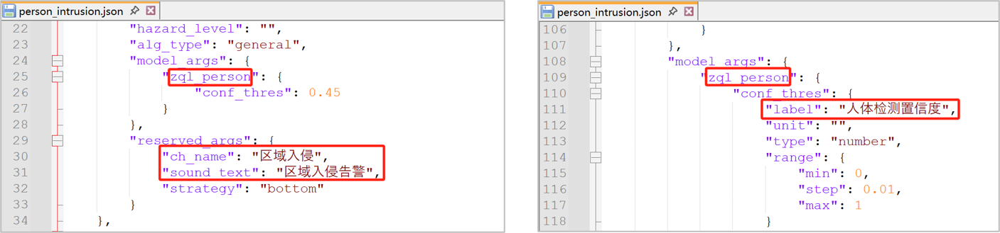

### 7. 算法包加密&导入

- 将算法包加密为bin文件。下载算法包[加密工具](https://pan.baidu.com/s/173r6sLMh77n3JrKkLnSpYg?pwd=0000)。将待加密算法包放在文件夹内（文件夹只含单个算法包），填写待加密算法包的上级路径（如下述文件夹所示），点击【确定】按钮，提示即将加密的算法包名称，点击【ok】；

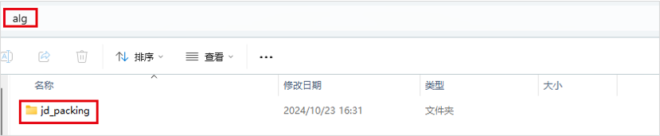

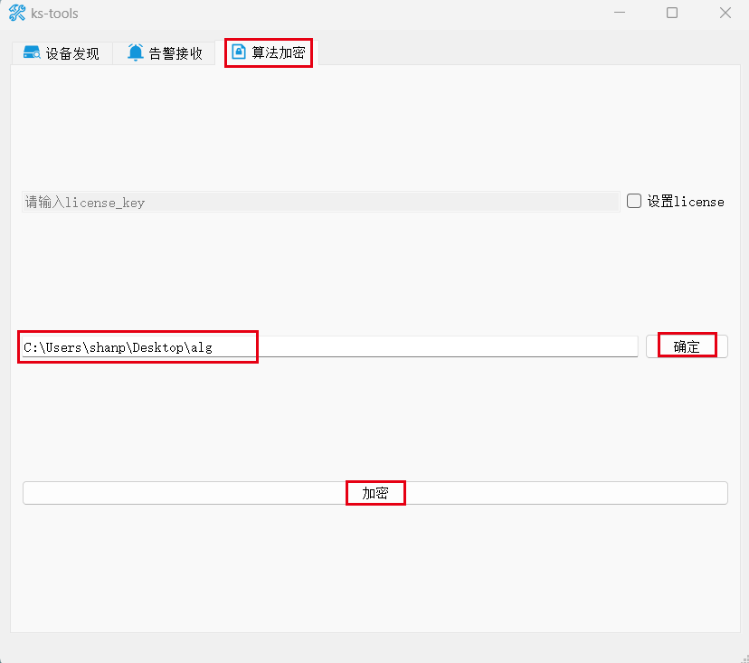

- 加密完成的bin文件为最终文件，从盒子后台管理系统【算法仓库】中导入即可。

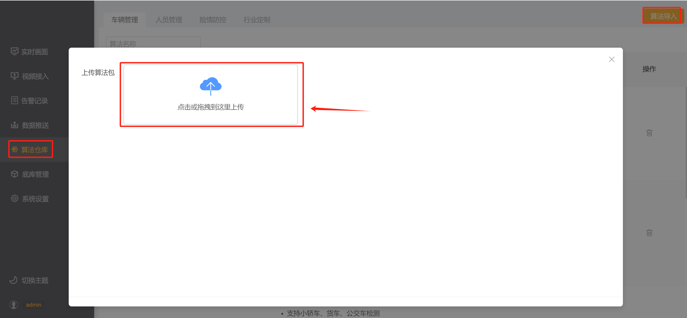

### 8. 代码调试

- 在下图所示红色框内，连续点击7次，打开开发者模式（版本≥3.1.6具备此功能）

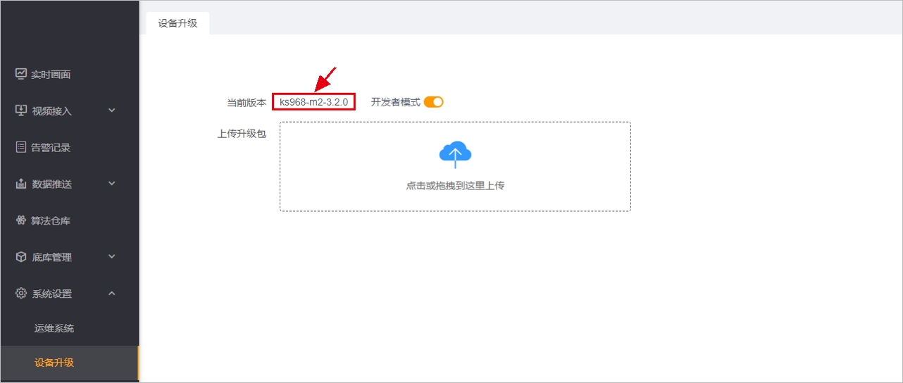

- 在高级设置，终端管理中，可进入盒子后台调试&查看日志（请勿删除系统源码，谨慎操作，否则造成设备不可用）

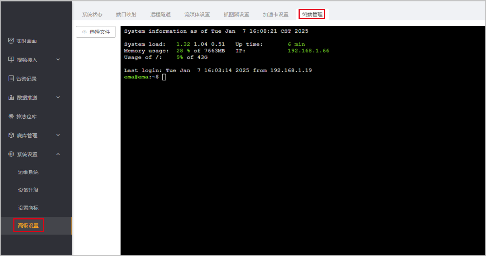

- 调试代码。导入`logger`包，使用`LOGGER.info`输出日志。示例如下。

```python
from logger import LOGGER

LOGGER.info('boxes:{},classes:{},scores:{}'.format(boxes, classes, scores))
```

-  查看日志

查看推理模块日志

```bash
tail -f ks/ks968/data/logs/engine/0/engine.log
```

查看后处理模块日志

```bash
tail -f ks/ks968/data/logs/filter/filter.log
```

### 9. 附录

以上的推理与后处理实例继承分别继承于model与postprocessor基类，对于基类的具体解释如下。

推理与后处理代码位于[general](../../general)文件夹下。下图为模块调用流程图。

- **推理模块**：从解码队列中取出图像数据，进行模型推理，并将推理结果写入推理队列。
- **后处理模块**：从推理队列中取出结构化数据进行业务逻辑处理产生告警，并将告警结果写入告警队列。

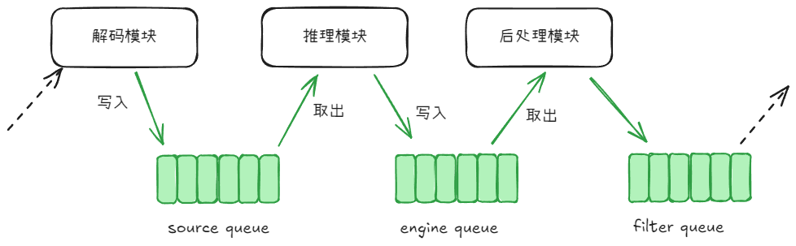

#### 推理模块代码说明

推理模块代码包括`基础模块`与`推理实例`两部分。

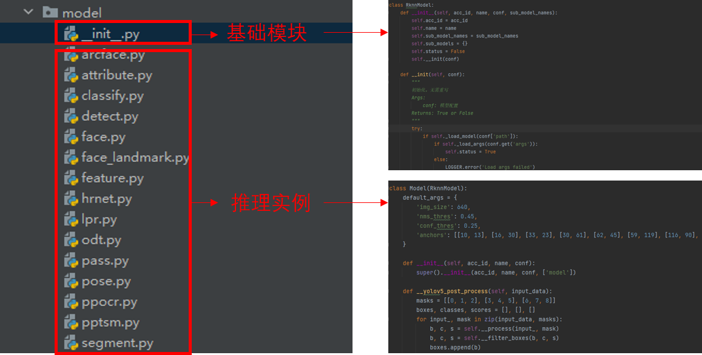

**A. 基础模块**`__init__.py`

`模型推理base模块`中的`RknnModel`类的成员函数按功能可以分为以下3类：`初始化函数`、`核心逻辑函数`、`工具函数`。其中`工具函数`无需在后处理实例模块中覆写（`override`）；`初始化函数`中的部分函数无需覆写，部分函数如（`_load_args`）根据自定义需求覆写；`核心逻辑函数`通常需要覆写。

**初始化函数**

|   函数名称    |             函数功能              |
| :-----------: | :-------------------------------: |
|  _load_model  |   加载模型，**通常不需要覆写**    |
|  _load_args   |  加载模型参数，**通常需要覆写**   |
| _init_runtime | 初始化runtime环境，**不需要覆写** |
|  _rknn_infer  |   rknn模型推理，**不需要覆写**    |
|    release    | 释放已加载的模型，**不需要覆写**  |

**核心逻辑函数**

| 函数名称 |        函数功能        |
| :------: | :--------------------: |
|  infer   | 推理函数，**需要覆写** |

**B. 推理实例**

###### 基础算法类型

* `zql_arcface`：特征提取算法，适用于工服检测、未佩戴护目镜检测、未戴手套检测等；
* `zql_classify`：分类算法，适用于睡岗识别、安全帽识别、火焰识别等；
* `zql_detect`：目标检测算法，适用于基于yolov5的检测模型；
* `zql_face_landmark`：人脸关键点提取，适用于疲劳检测；
* `zql_face`：人脸检测+人脸特征提取，适用于人脸识别；
* `zql_feature`：特征提取算法，适用于消防通道占用等；
* `zql_hrnet`：人体关键点检测模型，适用于hrnet的关键点检测模型；
* `zql_lpr`：车牌检测+车牌识别，适用于车牌识别；
* `zql_pass`：适用于无模型的算法；
* `zql_pose`：人体关键点检测，适用于基于yolov8.1的关键点检测模型；
* `zql_ppocr`：光学字符检测+识别，适用于光学字符识别；
* `zql_segment`：分割算法，适用于基于yolov5-v7.0的分割模型；

【注：自定义推理模型，避免与基础算法类型相同】

###### 函数参数

* `data`，推理数据，通常是图像数据。

* `**kwargs`，用户自定义`k-v`参数对。

#### 后处理模块代码说明

**A. 基础模块`__init__.py`**

算法后处理模块在`filter`算子中实现，代码路径：`filter/postprocessor`，其内部按功能可划分为：`工具模块`、`后处理模块`，其中`后处理模块`又可细分为：`后处理base模块`以及`后处理实例模块`，目录结构如下图所示。

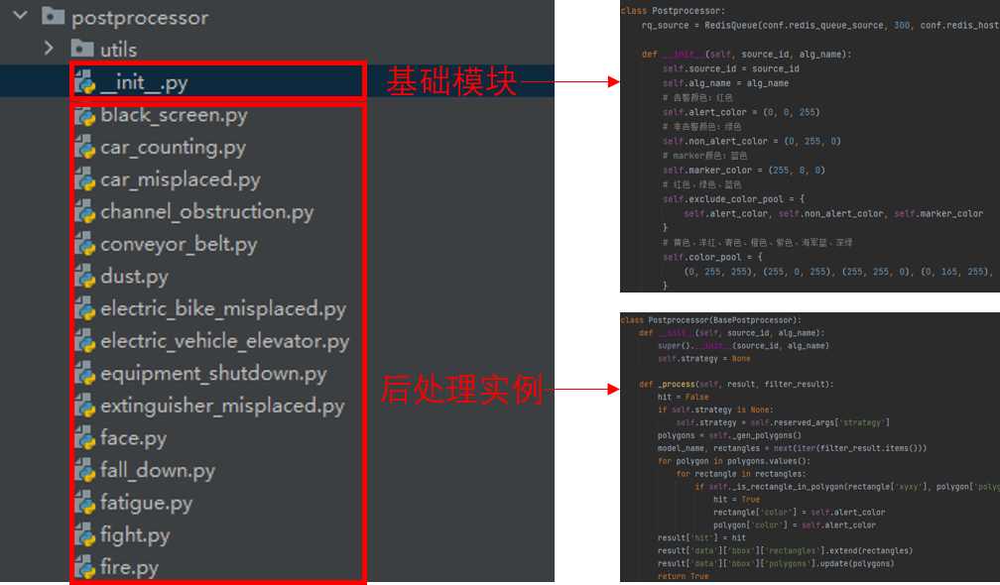

**入口函数**

|  函数名称   |       函数功能       |
| :---------: | :------------------: |
| postprocess | 后处理模块的入口函数 |

**核心逻辑函数**

| 函数名称 |                   函数功能                   |
| :------: | :------------------------------------------: |
| _filter  |       过滤掉不符合条件的目标，按需覆写       |
| _process | 处理过滤之后的结果，并生成最终结果，按需覆写 |

##### _filter

###### 函数参数

* `model_name`，模型名称，注意：`模型名称`有别于`算法名称`以及`模型类型`。

* `model_data`，模型数据，由算法引擎推理结果以及相关参数组成的结构化数据。

  ```json
  {
      "engine_result": [{
              "conf": 0.45,
              "label": 0,
              "xyxy": [375, 105, 424, 142]
          }, {
              "conf": 0.29,
              "label": 0,
              "xyxy": [320, 120, 368, 137]
          }
      ],
      "model_conf": {
          "args": {
              "conf_thres": 0.5
          },
          "label": {
              "class2label": {
                  "0": "fire"
              },
              "label2color": {
                  "火焰": [0, 0, 255]
              },
              "label_map": {
                  "fire": "火焰"
              }
          }
      }
  }
  ```

  其中，`engine_result`为算法引擎推理结果，`model_conf`为算法参数。

###### 函数输出

函数输出为过滤之后的结果：

```json
[
    {
        "conf": 0.63,
        "label": 0,
        "xyxy": [313, 95, 428, 142]
    }
]
```

##### _process

###### 函数参数

* `result`，后处理最终的输出数据结构模板。

  ```json
  {
      "data": {
          "bbox": {
              "lines": {},
              "polygons": {},
              "rectangles": []
          },
          "custom": {}
      },
      "hit": false
  }
  ```

  其中，`data/bbox`是用与在告警结果中画框的相关数据，`data/custom`是用户的自定义数据，`hit`表示是否命中了告警行为。

* `filter_result`，过滤器过滤之后的相关模型（如：`fire`、`fire_classify`）的结果数据

  ```json
  {
      "fire": [{
              "color": [0, 0, 255],
              "conf": 0.63,
              "ext": {},
              "label": "火焰",
              "xyxy": [626, 190, 856, 284]
          }
      ],
      "fire_classify": []
  }
  ```

###### 函数输出

`True` or `False`

**工具函数**

|             函数名称              |                           函数功能                           |
| :-------------------------------: | :----------------------------------------------------------: |
|            _is_in_plan            | 判定算法是否在布控计划时间内，不在布控计划时间内的算法不予处理 |
|            _get_label             |                       获取目标的label                        |
|         _gen_random_color         |                        生成随机color                         |
|            _get_color             |                       获取目标的color                        |
|            _get_point             | 根据指定策略获取矩形框的点，如：中心点、下边沿中心点、右边沿中心点 |
|     _is_rectangle_in_polygon      |                   判断矩形框是否在多边形内                   |
|       _cross_line_counting        |                           跨线计数                           |
| _merge_cross_line_counting_result |                       合并跨线计数结果                       |
|             _set_ext              |                       设置扩展字段的值                       |
|             _get_ext              |                       获取扩展字段的值                       |
|          _gen_rectangle           |                          生成矩形框                          |
|           _gen_polygons           |                          生成多边形                          |
|            _gen_lines             |                           生成线段                           |
|              _scale               |                           坐标缩放                           |
|          _filter_by_conf          |                  过滤掉置信度低于阈值的目标                  |
|         _filter_by_label          |                 过滤掉不在label列表中的目标                  |
|          _filter_by_roi           |                过滤掉中心点不在多边形内的目标                |

**B. 后处理实例**

每个算法使用自有后处理代码，详见每个类型实例部分代码说明。
