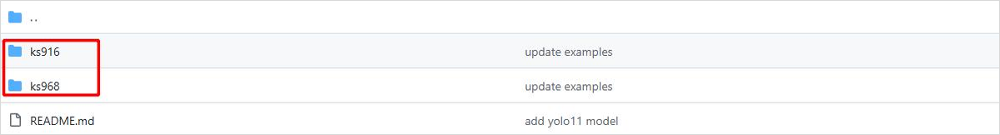
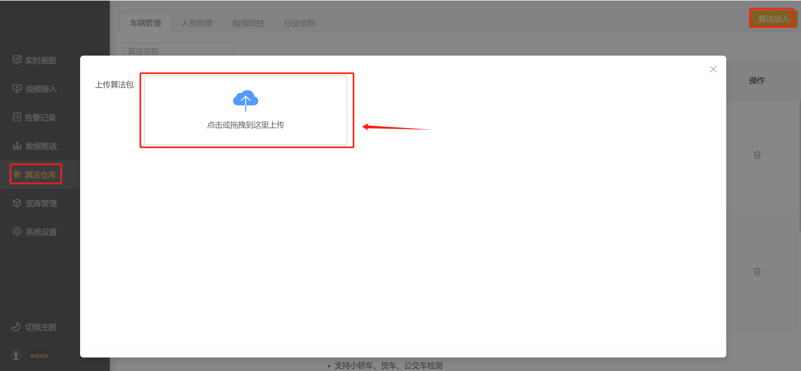

### 1. 下载示例算法包

```
git clone https://github.com/AIDrive-Research/EdgeAI-Toolkit.git
```

下载示例算法包，并在示例算法包上修改。

- 如果产品型号为ks968，则在ks968下的car_type算法包上修改。
- 如果产品型号为ks916，则在ks916下的car_type算法包上修改。



产品型号查看，产品型号在【系统设置】-【设备升级】中可查看。


### 2. 模型训练

模型训练参照yolov5训练[文档](../../../train/detection/yolov5/)，训练完成后导出onnx模型。

### 3. 模型量化

模型量化参照[文档](../../../quantization/rockchip/)，量化完成后得到rknn模型。

### 4. 配置文件修改

修改算法包的如下配置项。

| 修改项             | 详情                                                         |
| ------------------ | ------------------------------------------------------------ |
| 算法名称           | 算法包文件夹名称、后处理代码文件名称、后处理json文件名称以及postprocessor.yaml中的name需要保持一致。新算法名称不得与已有算法名称重复。 |
| 模型名称           | 模型文件夹名称、model.yaml中的模型名称、postprocessor.yaml中的模型名称、xxx.json中的模型名称需保持一致。新模型名称不得与已有模型名称重复。 |
| 模型文件           | 模型文件夹下的模型，统一命名model（不要命名为model.rknn）    |
| 模型类型           | model文件夹下的.py文件为模型类型，新模型类型不得与已有模型类型重复。 |
| model.yaml         | 修改模型名称、检测类型（模型名称）、输入参数、推理时间。     |
| postprocessor.yaml | 修改算法中英文名称、算法描述、分组类别、模型配置。           |
| xxx.json           | 修改json文件中的模型名称、算法名称、语音文本等内容。         |

- **算法名称修改**。修改为自己定义的算法名称，如：custom_car_type，若不修改，会覆盖已有算法文件。


- **模型名称修改**。修改为自定义的模型名称，如custom_common，若不修改，会覆盖已有模型。


- **模型文件修改**。量化后的模型文件统一命名为model，如下图所示，不可命名为model.rknn。


- **模型类型修改**。模型类型为推理代码文件名称，修改为自定义名称。如custom_detect.py。


- **model.yaml文件修改**。第1行是模型名称，第2行模型类型是推理代码的名称，第4行-第6行是模型输入参数。第7行是模型推理时间，其设置应当保证source队列没有积压，若队列存在积压，则增加推理时间。


- **postprocessor.yaml文件修改**。第1行是算法名称，第2行是算法中文名称，第3行是算法描述，第4行是算法组类别，第6行至第15行是模型参数，第16行是告警label，从label_map中的value中进行选择。第17行为后处理时间，其设置应当保证engine队列没有积压，若队列存在积压，则增加处理时间。


- **前端配置文件xxx.json修改**。详细可参照[前端配置文件](../../JSON.md)。修改模型名称、算法名称、语音播报内容、置信度label等。


### 5. 算法包加密与导入

- 将算法包加密为bin文件。下载算法包[加密工具](https://pan.baidu.com/s/173r6sLMh77n3JrKkLnSpYg?pwd=0000)。将待加密算法包放在文件夹内（文件夹只含单个算法包），填写待加密算法包的上级路径（如下述文件夹所示），点击【确定】按钮，提示即将加密的算法包名称，点击【ok】；


- 加密完成的bin文件为最终文件，从盒子后台管理系统【算法仓库】中导入即可。


