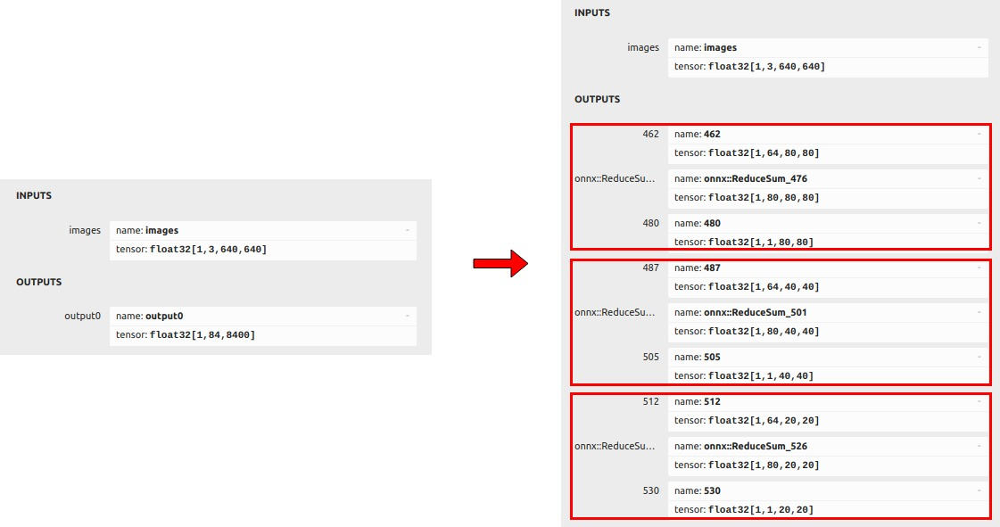
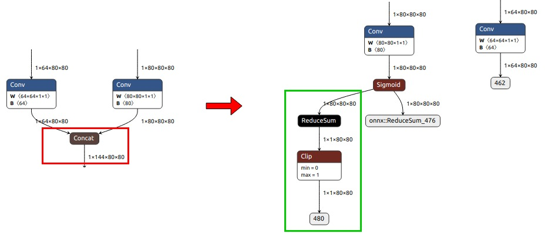

## 1. 代码解析

以下为yolo11推理代码，核心代码包括`infer`函数与`process`函数两部分。

```python
class Model(RknnModel):
    default_args = {
        'img_size': 640,
        'nms_thres': 0.45,
        'conf_thres': 0.25,
    }

    def __init__(self, acc_id, name, conf):
        super().__init__(acc_id, name, conf, ['model'])

    def process(self, input_data):
        boxes, scores, classes_conf = [], [], []
        defualt_branch = 3
        pair_per_branch = len(input_data) // defualt_branch
        for i in range(defualt_branch):
            boxes.append(self.box_process(input_data[pair_per_branch * i]))
            classes_conf.append(input_data[pair_per_branch * i + 1])
            scores.append(np.ones_like(input_data[pair_per_branch * i + 1][:, :1, :, :], dtype=np.float32))

        def sp_flatten(_in):
            ch = _in.shape[1]
            _in = _in.transpose(0, 2, 3, 1)
            return _in.reshape(-1, ch)

        boxes = [sp_flatten(_v) for _v in boxes]
        classes_conf = [sp_flatten(_v) for _v in classes_conf]
        scores = [sp_flatten(_v) for _v in scores]
        boxes = np.concatenate(boxes)
        classes_conf = np.concatenate(classes_conf)
        scores = np.concatenate(scores)
        boxes, classes, scores = self.filter_boxes(boxes, scores, classes_conf)
        nboxes, nclasses, nscores = [], [], []
        for c in set(classes):
            inds = np.where(classes == c)
            b = boxes[inds]
            c = classes[inds]
            s = scores[inds]
            keep = self.nms_boxes(b, s)
            if len(keep) != 0:
                nboxes.append(b[keep])
                nclasses.append(c[keep])
                nscores.append(s[keep])
        if not nclasses and not nscores:
            return None, None, None
        boxes = np.concatenate(nboxes)
        classes = np.concatenate(nclasses)
        scores = np.concatenate(nscores)
        return boxes, classes, scores

    def filter_boxes(self, boxes, box_confidences, box_class_probs):
        box_confidences = box_confidences.reshape(-1)
        class_max_score = np.max(box_class_probs, axis=-1)
        classes = np.argmax(box_class_probs, axis=-1)
        _class_pos = np.where(class_max_score * box_confidences >= self.conf_thres)
        scores = (class_max_score * box_confidences)[_class_pos]
        boxes = boxes[_class_pos]
        classes = classes[_class_pos]
        return boxes, classes, scores

    def nms_boxes(self, boxes, scores):
        x = boxes[:, 0]
        y = boxes[:, 1]
        w = boxes[:, 2] - boxes[:, 0]
        h = boxes[:, 3] - boxes[:, 1]
        areas = w * h
        order = scores.argsort()[::-1]
        keep = []
        while order.size > 0:
            i = order[0]
            keep.append(i)
            xx1 = np.maximum(x[i], x[order[1:]])
            yy1 = np.maximum(y[i], y[order[1:]])
            xx2 = np.minimum(x[i] + w[i], x[order[1:]] + w[order[1:]])
            yy2 = np.minimum(y[i] + h[i], y[order[1:]] + h[order[1:]])
            w1 = np.maximum(0.0, xx2 - xx1 + 0.00001)
            h1 = np.maximum(0.0, yy2 - yy1 + 0.00001)
            inter = w1 * h1
            ovr = inter / (areas[i] + areas[order[1:]] - inter)
            inds = np.where(ovr <= self.nms_thres)[0]
            order = order[inds + 1]
        keep = np.array(keep)
        return keep

    def box_process(self, position):
        grid_h, grid_w = position.shape[2:4]
        col, row = np.meshgrid(np.arange(0, grid_w), np.arange(0, grid_h))
        col = col.reshape(1, 1, grid_h, grid_w)
        row = row.reshape(1, 1, grid_h, grid_w)
        grid = np.concatenate((col, row), axis=1)
        stride = np.array([self.img_size // grid_h, self.img_size // grid_w]).reshape(1, 2, 1, 1)
        position = self.dfl(position)
        box_xy = grid + 0.5 - position[:, 0:2, :, :]
        box_xy2 = grid + 0.5 + position[:, 2:4, :, :]
        xyxy = np.concatenate((box_xy * stride, box_xy2 * stride), axis=1)
        return xyxy

    def dfl(self, position):
        n, c, h, w = position.shape
        p_num = 4
        mc = c // p_num
        y = position.reshape(n, p_num, mc, h, w)
        from scipy.special import softmax
        y = softmax(y, axis=2)
        acc_metrix = np.arange(mc).reshape(1, 1, mc, 1, 1).astype(np.float32)
        y = (y * acc_metrix).sum(axis=2)
        return y

    def _load_args(self, args):
        try:
            self.img_size = args.get('img_size', self.default_args['img_size'])
            self.nms_thres = args.get('nms_thres', self.default_args['nms_thres'])
            self.conf_thres = args.get('conf_thres', self.default_args['conf_thres'])
        except:
            LOGGER.exception('_load_args')
            return False
        return True

    def infer(self, data, **kwargs):
        """
        目标检测
        Args:
            data: 图像数据，ndarray类型，RGB格式（BGR格式需转换）
        Returns: infer_result
        """
        infer_result = []
        if self.status:
            try:
                image = data
                scale = 1
                raw_width, raw_height = image.shape[1], image.shape[0]
                if max(image.shape[:2]) != self.img_size:
                    scale = self.img_size / max(image.shape[:2])
                    if raw_height > raw_width:
                        image = cv2.resize(image, (int(raw_width * scale), self.img_size))
                    else:
                        image = cv2.resize(image, (self.img_size, int(raw_height * scale)))
                image, dw, dh = self._letterbox(image, (self.img_size, self.img_size))
                image = np.expand_dims(image, axis=0)
                outputs = self._rknn_infer('model', [image])
                boxes, classes, scores = self.process(outputs)
                if boxes is not None:
                    for i, box in enumerate(boxes):
                        obj = {
                            'label': int(classes[i]),
                            'conf': round(float(scores[i]), 2)
                        }
                        xyxy = [int(box[0] - dw), int(box[1] - dh), int(box[2] - dw), int(box[3] - dh)]
                        if scale != 1:
                            xyxy = [int(x / scale) for x in xyxy]
                        obj['xyxy'] = [xyxy[0] if xyxy[0] >= 0 else 0,
                                       xyxy[1] if xyxy[1] >= 0 else 0,
                                       xyxy[2] if xyxy[2] <= raw_width else raw_width,
                                       xyxy[3] if xyxy[3] <= raw_height else raw_height]
                        infer_result.append(obj)
            except:
                LOGGER.exception('exception')
        return infer_result
```

**核心函数：infer**

###### 函数输入

- `data：`RGB图像数据
- `**kwargs：`用户自定义k-v参数对

###### 函数输出

- `infer_result`，格式如下。

```json
[
    {
        "conf": 0.83,
        "label": 0,
        "xyxy": [282, 286, 344, 325]
    }, {
        "conf": 0.62,
        "label": 0,
        "xyxy": [120, 262, 157, 289]
    }
]
```

###### 处理过程

- `self._letterbox():` 对输入图像进行填充缩放。
- `self._rknn_infer():` rknn模型推理。
- `self.process():` 对rknn推理结果进行目标框、类别、置信度解码；过滤低置信度目标；非极大值抑制去除冗余目标。

## 2. 训练代码

训练源码参考以下代码仓库:  https://github.com/airockchip/ultralytics_yolo11

## 3. 预训练模型

**下载链接：**

[./yolo11n.onnx](https://ftrg.zbox.filez.com/v2/delivery/data/95f00b0fc900458ba134f8b180b3f7a1/examples/yolo11/yolo11n.onnx)<br />[./yolo11s.onnx](https://ftrg.zbox.filez.com/v2/delivery/data/95f00b0fc900458ba134f8b180b3f7a1/examples/yolo11/yolo11s.onnx)<br />[./yolo11m.onnx](https://ftrg.zbox.filez.com/v2/delivery/data/95f00b0fc900458ba134f8b180b3f7a1/examples/yolo11/yolo11m.onnx)

**onnx导出方法：**

**注：** 导出yolo11 onnx模型，请参考：[RKOPT_README.zh-CN.md](https://github.com/airockchip/ultralytics_yolo11/blob/main/RKOPT_README.zh-CN.md) / [RKOPT_README.md](https://github.com/airockchip/ultralytics_yolo11/blob/main/RKOPT_README.md)

**注：** 这里提供的模型是优化后的模型，与官方的原始模型有所不同。以yolo11n.onnx为例说明两者的差异。

1、两者的输出如下图所示。左边是官方原始模型，右边是优化后的模型。优化后的模型分为三部分。例如，在 ([1,64,80,80],[1,80,80,80],[1,1,80,80])的输出中，[1,64,80,80]是预测框坐标，[1,80,80,80] 是预测框中80个类别的置信度。[1,1,80,80]是80个类别置信度的总和。

<div align=center>
  
</div>


2、以 ([1,64,80,80],[1,80,80,80],[1,1,80,80])为例进行说明，移除了两个卷积节点后的子图，保留了([1,64,80,80],[1,80,80,80])两个卷积输出。并增加ReduceSum+Clip来计算80个类别的置信度([1,1,80,80])，引入这个分支的作用是用于后处理阶段加速阈值筛选。

<div align=center>
  
</div>

## 4. 模型量化

参照模型量化[README.md](../../../quantization/rockchip/README.md)，将onnx模型转换为RKNN模型。
